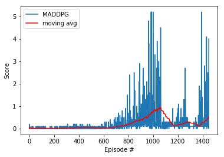
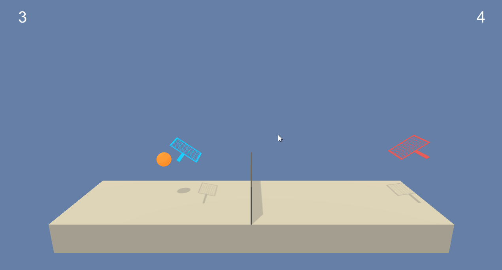

# Report: Continuous Control

## Implemented Algorithm
Similar to the reasoning pointed out in the previous [Continuous Control](https://github.com/MrDaubinet/Continuous-Control) Project. Due to the nature of the environment being a continuous control problem. The reinforcement learning agorithm needs to be able to work in a continuous space. This hard requirement means we have to use a deep learning approach where neural networks are used for continuous function approximation. When considering between Policy-based vs Value-based Methods. Policy-based methods are better suited for continuous action spaces. I selected the [https://arxiv.org/pdf/1706.02275.pdf](https://arxiv.org/pdf/1706.02275.pdf) algorithm, since I had already implemented the ddpg algorithm for the previous project and it could be adapted to the maddpg algorithm with some minor changes.

I copied the Actor and Critic models, as [found here](https://github.com/MrDaubinet/Continuous-Control/blob/master/model.py), but I removed batch normalization from the actor model and changed the critics input shape to accept states and actions from both agents. I copied the agent code, [found here](https://github.com/MrDaubinet/Continuous-Control/blob/master/agent.py), then changed it to accomidate a single environment, where both agents share the critic model.

The ```MADDPG()``` code can be [found here](https://github.com/MrDaubinet/collaboration-and-competition/blob/master/maddpg.py) resulting DDPG algorithm can be seen below:
```python
    def train(self, n_episodes=5000, max_t=int(1000)):
        scores_deque = deque(maxlen=100)
        scores = []
        average_scores_list = []

        for i_episode in range(1, n_episodes+1):                                    
            env_info = self.env.reset(train_mode=True)[self.brain_name]     
            states = env_info.vector_observations               
            score = np.zeros(self.num_agents)

            self.reset()

            for t in range(max_t):
                actions = self.act(states)
                env_info = self.env.step(actions)[self.brain_name]            
                next_states = env_info.vector_observations
                rewards = env_info.rewards         
                dones = env_info.local_done                         
                self.step(states, actions, rewards, next_states, dones, t)        
                states = next_states
                score += rewards  

                if any(dones):                                 
                    break

            score_max = np.max(score)
            scores.append(score_max)
            scores_deque.append(score_max)
            average_score = np.mean(scores_deque)
            average_scores_list.append(average_score)

            print('\rEpisode {}\tAverage Score: {:.3f}'.format(i_episode, np.mean(scores_deque)), end="")  

            if i_episode % 100 == 0:
                print('\rEpisode {}\tAverage score: {:.3f}'.format(i_episode , average_score))

            if average_score >= 0.5:
                self.save_weights()
                print("\rSolved in episode: {} \tAverage score: {:.3f}".format(i_episode , average_score))
                break
        return scores , average_scores_list

```

## Results
The model was not very consistent in achieving the required score (0.5) and often when it did, it would proceed to decrease in score drastically if left to train more. In one one of the better runs, it was able to achieve the result in around 1000 epochs, in others it could take longer. Worst of all, in allot of approached, the average moving score would gradually increase and then suddenly drop and become terrible

```
# plot the scores
fig = plt.figure()
ax = fig.add_subplot(111)
plt.plot(np.arange(len(scores)), scores, label='DDPG')
plt.plot(np.arange(len(scores)), avgs, c='r', label='moving avg')
plt.ylabel('Score')
plt.xlabel('Episode #')
plt.legend(loc='upper left');
plt.show()
```



To see one of them in action check the gif below.



Not the smartest kids on the block, they met "minimum requirements", but they don't seem all that great. It could be that these guys trained for too long and become unstable, clearly room for improvement. 

## Ideas for Future Work
* **Code Improvements** - I think the models could be made more robust, perhaps with a different approach to implementing MADDPG and how the shared buffer is used.  
* **Hyperparameter optimization** - Most algorithms can be tweeked to perform better for specific environments when by changeing the various hyper parameters. This could be investigated to find a more effective agent.
* **Priority Experience Replay** - Prioritized experience replay selects experiences based on a priority value that is correlated with the magnitude of error. This replaces the random selection of experiences with an approach that is more intelligent, as described in [this paper](https://arxiv.org/pdf/1511.05952.pdf). 

# Get Started
1. Install Anaconda from [here](https://www.anaconda.com/). 
2. Create a new evironment from the environment file in this repository with the command 
    ```
    conda env create -f environment.yml
    ```
3. Run ```python main.py```

    Remove the comments in main to train and run the baseline.

4. Watch the agents vs one another.